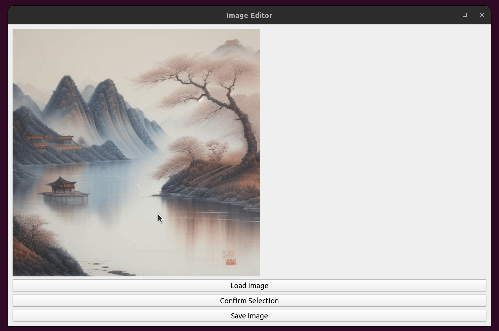

# MaskQt

`main.py`: use mouse to draw a mask on the image (GUI), and save the mask as a binary image.

`draw_mask.py`: use bg, ref image and params (CENTER_ROW_FROM_TOP, CENTER_COL_FROM_LEFT, SCALE) to draw a mask. (for TF-ICON)

`seg_min.py`: use fg_seg to crop fg to minimal.